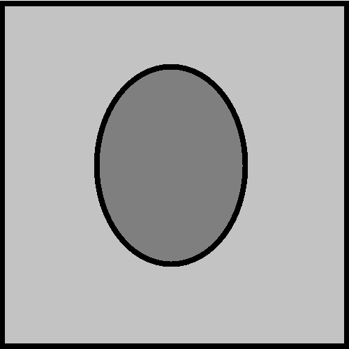

<head>
   
</head>
<body>
   

   
   
   
   

      

         <button type="button" onclick="put(2,2)">
         
         </button>
      

      

         <button type="button" onclick="put(2,3)">
         
         </button>
      

      

         <button type="button" onclick="put(2,4)">
         
         </button>
      

      

         <button type="button" onclick="put(2,5)">
         
         </button>
      

      

         <button type="button" onclick="put(2,6)">
         
         </button>
      

      

         <button type="button" onclick="put(2,7)">
         
         </button>
      

      

         <button type="button" onclick="put(2,8)">
         
         </button>
      

      

         <button type="button" onclick="put(2,9)">
         
         </button>
      

      

         <button type="button" onclick="put(3,2)">
         
         </button>
      

      

         <button type="button" onclick="put(3,3)">
         
         </button>
      

      

         <button type="button" onclick="put(3,4)">
         
         </button>
      

      

         <button type="button" onclick="put(3,5)">
         
         </button>
      

      

         <button type="button" onclick="put(3,6)">
         
         </button>
      

      

         <button type="button" onclick="put(3,7)">
         
         </button>
      

      

         <button type="button" onclick="put(3,8)">
         
         </button>
      

      

         <button type="button" onclick="put(3,9)">
         
         </button>
      

      

         <button type="button" onclick="put(4,2)">
         
         </button>
      

      

         <button type="button" onclick="put(4,3)">
         
         </button>
      

      

         <button type="button" onclick="put(4,4)">
         
         </button>
      

      

         <button type="button" onclick="put(4,5)">
         
         </button>
      

      

         <button type="button" onclick="put(4,6)">
         
         </button>
      

      

         <button type="button" onclick="put(4,7)">
         
         </button>
      

      

         <button type="button" onclick="put(4,8)">
         
         </button>
      

      

         <button type="button" onclick="put(4,9)">
         
         </button>
      

      

         <button type="button" onclick="put(5,2)">
         
         </button>
      

      

         <button type="button" onclick="put(5,3)">
         
         </button>
      

      

         <button type="button" onclick="put(5,4)">
         
         </button>
      

      

         <button type="button" onclick="put(5,5)">
         
         </button>
      

      

         <button type="button" onclick="put(5,6)">
         
         </button>
      

      

         <button type="button" onclick="put(5,7)">
         
         </button>
      

      

         <button type="button" onclick="put(5,8)">
         
         </button>
      

      

         <button type="button" onclick="put(5,9)">
         
         </button>
      

      

         <button type="button" onclick="put(6,2)">
         
         </button>
      

      

         <button type="button" onclick="put(6,3)">
         
         </button>
      

      

         <button type="button" onclick="put(6,4)">
         
         </button>
      

      

         <button type="button" onclick="put(6,5)">
         
         </button>
      

      

         <button type="button" onclick="put(6,6)">
         
         </button>
      

      

         <button type="button" onclick="put(6,7)">
         
         </button>
      

      

         <button type="button" onclick="put(6,8)">
         
         </button>
      

      

         <button type="button" onclick="put(6,9)">
         
         </button>
      

      

         <button type="button" onclick="put(7,2)">
         
         </button>
      

      

         <button type="button" onclick="put(7,3)">
         
         </button>
      

      

         <button type="button" onclick="put(7,4)">
         
         </button>
      

      

         <button type="button" onclick="put(7,5)">
         
         </button>
      

      

         <button type="button" onclick="put(7,6)">
         
         </button>
      

      

         <button type="button" onclick="put(7,7)">
         
         </button>
      

      

         <button type="button" onclick="put(7,8)">
         
         </button>
      

      

         <button type="button" onclick="put(7,9)">
         
         </button>
      

      

         <button type="button" onclick="put(8,2)">
         
         </button>
      

      

         <button type="button" onclick="put(8,3)">
         
         </button>
      

      

         <button type="button" onclick="put(8,4)">
         
         </button>
      

      

         <button type="button" onclick="put(8,5)">
         
         </button>
      

      

         <button type="button" onclick="put(8,6)">
         
         </button>
      

      

         <button type="button" onclick="put(8,7)">
         
         </button>
      

      

         <button type="button" onclick="put(8,8)">
         
         </button>
      

      

         <button type="button" onclick="put(8,9)">
         
         </button>
      

      

         <button type="button" onclick="put(9,2)">
         
         </button>
      

      

         <button type="button" onclick="put(9,3)">
         
         </button>
      

      

         <button type="button" onclick="put(9,4)">
         
         </button>
      

      

         <button type="button" onclick="put(9,5)">
         
         </button>
      

      

         <button type="button" onclick="put(9,6)">
         
         </button>
      

      

         <button type="button" onclick="put(9,7)">
         
         </button>
      

      

         <button type="button" onclick="put(9,8)">
         
         </button>
      

      

         <button type="button" onclick="put(9,9)">
         
         </button>
      

   

   
</body>
